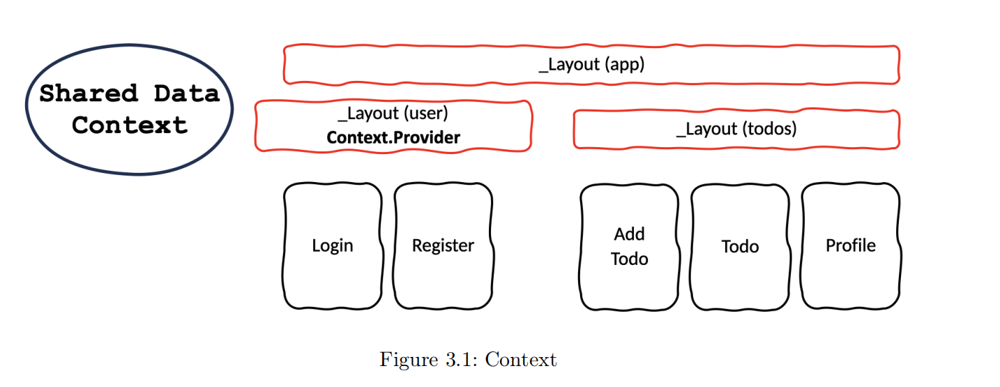
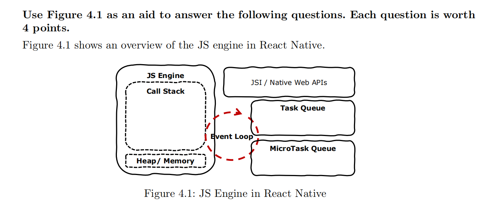
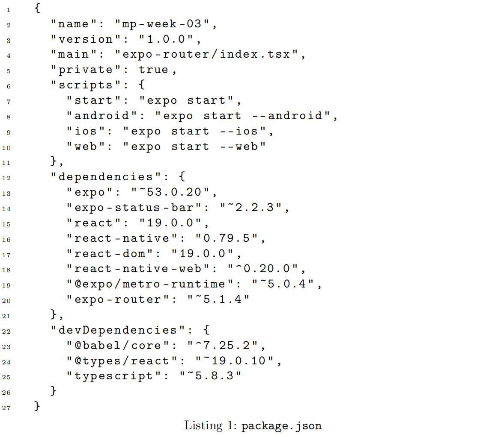

# Exercise 1. Mobile Computing

1、The most import stakeholder(s) in the mobile ecosystem is/are:

(A)	App Developers

(B)	Users

(C)	Mobile Operators

(D)	All of the above	✅


2、What does password primarily contribute to in the CIA triad?

(A)	Availability

(B)	Confidentiality	✅

(C)	Integrity

(D)	None of the above

- **C - Confidentiality**

- **I - Integrity**

- **A - Availability**

The primary function of a password is to prevent unauthorized individuals from accessing systems or information through an authentication mechanism, thereby safeguarding the confidentiality of information.


# Exercise 2. Designing Mobile Applications

3、The notifications should be designed carefully

(A)	to repeat as frequently as possible until the user pays attention

(B)	with actionable controls	✅

(C)	to get user attention at any time of the day

(D)	show as much as information as possible

***to repeat as frequently*** ❌,  ***at any time of the day*** ❌, ***as much as information*** ❌


4、McGurk effect is a good example of multimodal effects

(A)	Yes	✅

(B)	No


5、To manage attention, it is important to design interfaces that have

(A)	as much as possible spacing between elements

(B)	high colour contrast	✅

(C)	faster response time

(D)	the minimum amount of network data

***manage attention*** -> important information is **easily noticed**.


6、In *Norman’s conceptual framework* :

(A)	Designer’s Model should match User’s Model	✅

(B)	System Image should be minimized

(C)	Users are discouraged to create mental models

(D)	Designers are discouraged to create mental models

> Norman's Core Principles:
>
> “The **designer’s model** should be accurately communicated through the **system image**, so that the **user’s model** matches it.”

# Exercise 3. React Native - General

7、The Figure 3.1 shows an example how an app uses Context in React Native. **Context.Provider** indicates which component the context provider wraps. Please select the correct answer about which component can have access to the Shared Data Context.



(A)	Neither Login or Profile components can have access

(B)	Only Profile component can have access

(C)	Only _Layout(user) has access

(D)	Can be access from Login component	✅

```scss
_Layout(app)
 ├── _Layout(user) ← Context.Provider here
 │    ├── Login
 │    └── Register
 └── _Layout(todos)
      ├── Add Todo
      ├── Todo
      └── Profile

```

# Exercise 4. React Native - Architecture

8、Shadow thread in React Native is responsible for:

(A)	Event Handling

(B)	Manage Layout	✅

(C)	Processing style changes	✅

(D)	Rendering user interface




9、All JS codes must run through:

(A)	Call Stack	✅

(B)	Task Queue

(C)	MicroTask Queue

(D)	None of the above

>Whether it's synchronous code or asynchronous callbacks, they must ultimately enter the call stack to be executed.


10、If all two queues and call stack has code to be executed, priority will be given to

(A)	Call Stack	✅

(B)	Task Queue

(C)	MicroTask Queue

(D)	None of the above

```html
Call Stack → MicroTask Queue → Task Queue
```


11、Task Queue will be used when:

(A)	There is a call back function	✅

(B)	Anything after an await

(C)	Promise is returned

(D)	None of the above

### 🔹 A typical scenario for the Task Queue:

- `setTimeout(callback, 0)`
- `setInterval(callback, n)`
- `setImmediate(callback)`（Node.js）
- `I/O callbacks`
- `UI rendering callbacks`


# Exercise 5. package.json

The code Listing-1 below shows an example package.json file of a project developed by a student. You can assume all the versions listed are accurate and all the necessary libraries are imported.



12、Code Listing-1 has,

(A)	Errors	✅

(B)	No errors


13、The project that has Listing-1 can be started with the command

(A)	npm start	✅

(B)	npm run start	✅

(C)	npm run dependencies

(D)	npm install

# Exercise 6. Using useState Hook

```typescript
import React , { useState } from "react";
import { Text , TextInput , View , Pressable } from "react-native";
import { Link } from "expo-router";

type Props = {};

const Login = ( props : Props ) = > {
	let [email , setEmail] = useState < string >( " " );
	let password : string = " ";

	function setPassword ( text : string ) {
		password = text;
	}
	
	return (
    	<View style ={ styles.container }>
        	<Text>Login with email: {email} and password: {password}</Text>

			<TextInput 
				placeholder = "Email"
				placeholderTextColor = "#999"
				onChangeText ={(text) => setEmail (text)}
                value ={ email }
			/>
                    
            <TextInput 
				placeholder = "Password"
				placeholderTextColor = "#999"
				secureTextEntry
				onChangeText ={(text) => setPassword (text)}
                value ={ password }
			/>
                    
            <Pressable>
            	<Text>Sign In</Text>        
            </Pressable>   
        </View>
    );
};

 export default Login;
```

The code shown in the Listing-2 is written by a student with the expectation of creating an interface that shows a login screen and a string display to show the user name and password the user like to use. You should read and evaluate the code listing, and answer the following questions. This code listing is only used for the questions under this exercise.


14、The language in Listing-2 cab be best described as

(A)	JavaScript

(B)	TypeScript	✅


15、In Listing-2, some imports is/are unnecessary

(A)	Yes	✅

(B)	No

> import { Link } from "expo-router";


16、Does this code create a component that will work with an accessibility screen reader?

(A)	Yes

(B)	No	✅

```sql
accessibilityLabel
accessible={true}
accessibilityRole（Such as, "button", "text", "header" ）
```


17、Could the Listing-2 lead to compilation errors?

(A)	Yes	✅

(B)	No

```tsx
let password: string = "";

function setPassword(text: string) {
  password = text;
}

// might lead to ESLint error
```

> “A component is changing an uncontrolled input of type text to be controlled.”


18、According to the code in Listing-2, considering only the logic (assume if app errors exist, they were fixed), when user types name@email.com in the first TextInput, the Text element will

display the text:

(A)	Login with email: email and password: password

(B)	Login with email: name@email.com and password: password

(C)	Login with email: name@email.com and password:	✅

(D)	Login with email: name@email.com and password: Password


19、After typing name@email.com in the first TextInput, considering only the logic, if the user types 1234567 in the second TextInput, the Text element will display the text:

(A)	Login with email: email and password: password

(B)	Login with email: name@email.com and password: password

(C)	Login with email: name@email.com and password:	✅

(D)	Login with email: name@email.com and password: 1234567


# Exercise 7. Using Networks and Peripherals

20、Example(s) of a wide area network is/are

(A)	WiFi

(B)	5G	✅

(C)	NFC

(D)	BLE

> wide area network -> WAN


21、The best network for choice for an app that requires **high data transfer rate** with a **household**

**smart device** is: 

(A)	WiFi	✅

(B)	5G

(C)	NFC

(D)	BLE


22、A good example of ambient **light sensor** usage in a smartphone is

(A)	Control the screen brightness adaptively	✅

(B)	Adjust speaker volume with noise

(C)	Pay bills by tapping the phone on a payment device

(D)	Optical communication
